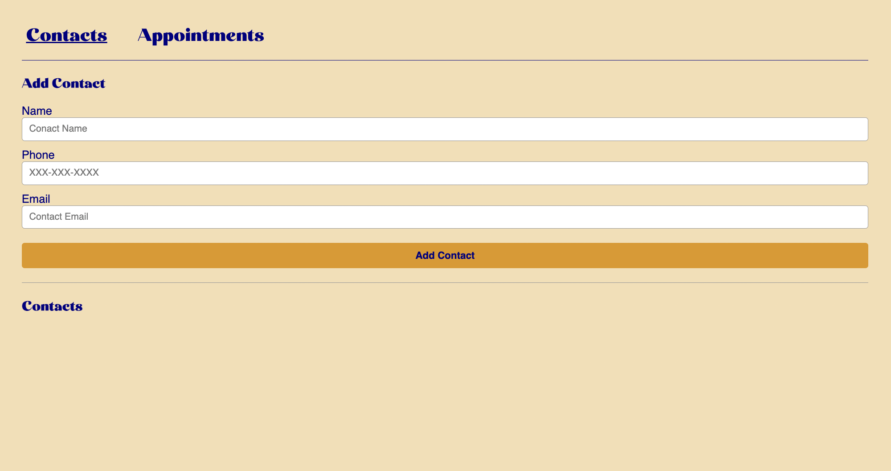

# Planner 

React frontend planner application for creating contact cards and appointments.

View live site [here](https://crk-planner.netlify.app/contacts)!

## Table of Contents 
* [Introduction](#introduction)
* [Technologies](#technologies)
* [Set Up](#set-up)
* [Documentation](#documentation)
    * [Containers](#containers)
    * [Components](#components)
* [Future Development](#future-development)
* [Sources](#sources)

## Intruduction 

This front-end app allows a user to create contacts and appointments in a virtual planner. 

The user can add new contacts, including name, phone, and email. The user can also make new appointments with a title, date, time, and optional contact included in the appointment. The user can toggle bewteen the contacts and appointments pages, viewing existinf contacts and appointments and adding new ones. 

This project was a learning exercise in building front-end React applications. 

## Technologies 

* `react` v. 17.0.1
* `react-dom` v. 17.0.1
* `react-router` v. 5.2.0
* `react-router-dom` v. 5.2.0
* `npm` v. 7.21.1

## Set Up

Live site hosted on [Netlify](https://crk-planner.netlify.app/contacts).

Or, install locally and run `npm install` then `npm start` in the project root and the app will be available on port 3000.

## Documentation

The app uses containers and hooks to manage the components associated with the contact and appointment states. The containers manage state for the stateless components. 

### Containers

- `contactsPage` a stateful component to handle the logic for adding new contacts and listing current contacts. 
    - Renders `<ContactForm />` for creating new contacts and a `<TileList />` for displaying existing contacts.

- `appointmentsPage` a stateful component that handles the logic for adding new appointments and listing current appointments.
    - Renders `<AppointmentForm />` for creating new appointments and a `<TileList />` for displaying existing appointments. 

### Components

- `<ContactForm />` a stateless component that renders a web form to collect the necessary contact information, including name, phone, and email. 

- `<AppointmentForm />` a stateless component that renders a web form to collect the necessary appointment information, including date, time, appointment title, and optional contact included. 
    - Includes rendering a `<ContactPicker />` to pick a contact included in the appointment. 

- `<ContactPicker />` a stateless component that renders a drop-down list of all contact names.

- `<TileList />` a stateless component that renders a list of `<Tile />` components using an array of objects, the objects being either contacts or appointments.

- `<Tile />` a stateless component that renders the data from an object, the object being a contact or appointment. 

## Future Development 

Will build out backend so that the user doesn't lose their contacts and appointments on each page refresh. 

## Sources

This app was created as part of [Codecademy's Fullstack Engineer](https://www.codecademy.com/learn) curriculum. Starter code was provided by Codecademy.